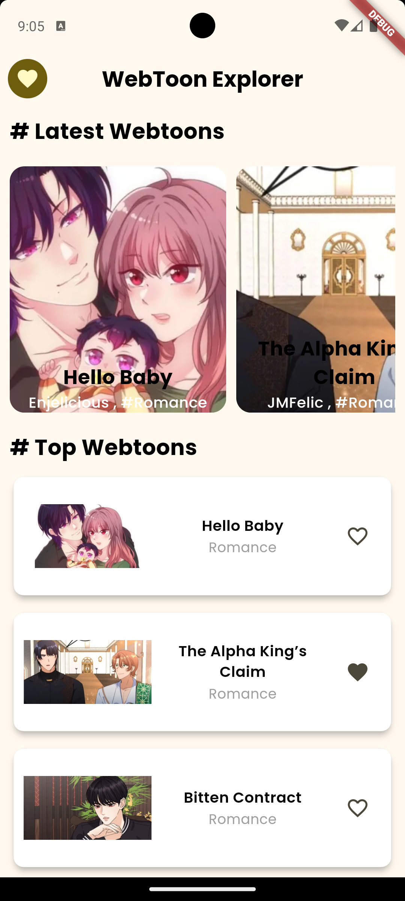
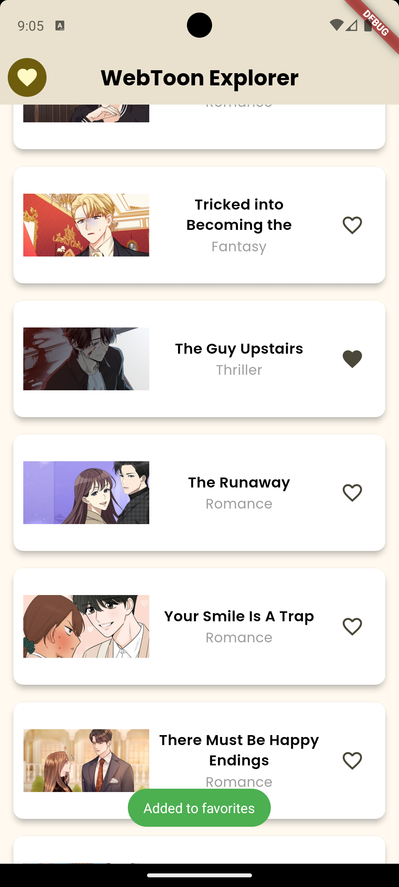
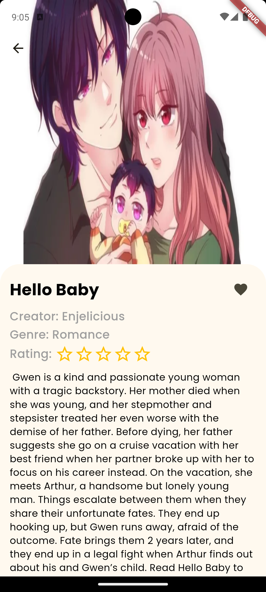
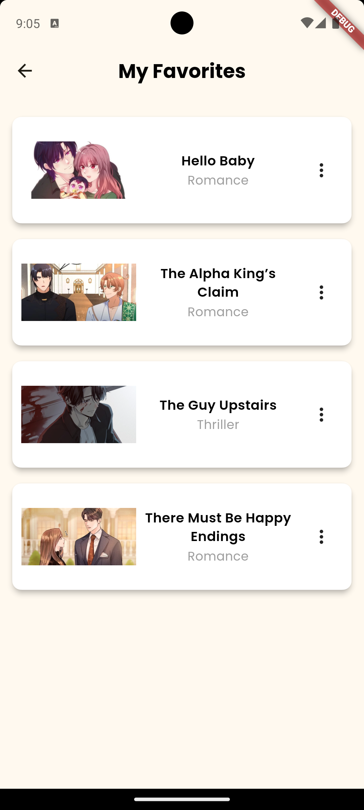
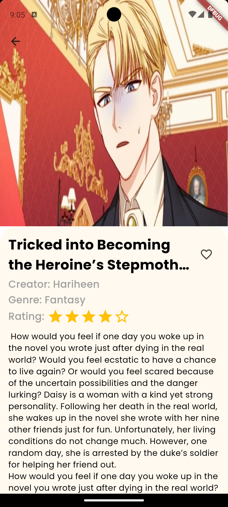

# webtoon_explorer_app

The Webtoons Explorer App is a sample project inspired by Webtoons content. The main purpose of the app is to showcase webtoons, allow users to add webtoons to favorites, rate webtoons etc. All data for the webtoons is loaded from a JSON file stored in the assets folder.

## Features

- **Home Screen**: Displays a list of the latest and top webtoons.
- **Details Screen**: Clicking on a webtoon brings the user to a details screen that provides information such as the creator, genre, and description of the webtoon.
- **Favorites**: Users can like a webtoon and add it to their favorites. Favorited webtoons are saved using the Hive database.
- **Ratings**: Users can rate a webtoon, and the average rating is shown in the details screen. Ratings are also stored using Hive.
- **Favorites Screen**: All favorite webtoons can be viewed on a dedicated favorites screen.

- ## Project Structure

The `lib` folder is organized into the following subfolders:

1. **providers**
   - Contains provider model classes used for managing the application state.
  
2. **router**
   - Contains routing logic, including route constants (names for each screen) and the `generateRoute` function to navigate between screens.
  
3. **models**
   - Contains data models, such as webtoon model fetched from JSON file.

4. **screens**
   - Contains a folder for each screen of the app, and within each screen folder, a `widget` subfolder holds the widgets associated with that screen.

5. **services**
   - Contains service files, such as those for fetching data from the api etc.

6. **database**
   - Contains database models and functions for Hive database.

7. **utils**
   - Contains utility files, such as assets and other helper functions used throughout the app.

## State Management
- The application uses the **Provider** package for state management, ensuring a smooth and responsive user experience.

## Screenshots

<table>
  <tr>
    <td>
      
      
<b>Home Screen</b>

    </td>
    <td>
      
      
<b>Adding to favorites</b>

    </td>
    <td>
      
      
<b>Detail Screen</b>

    </td>
  </tr>
   <tr><td colspan="3">
</td></tr>

  <tr>
    <td>
      
      
<b>Favorites Screen</b>

    </td>
    <td>
      
      
<b>Rating feature</b>

    </td>
   
  </tr>
  <tr><td colspan="3">
</td></tr>

  
</table>

